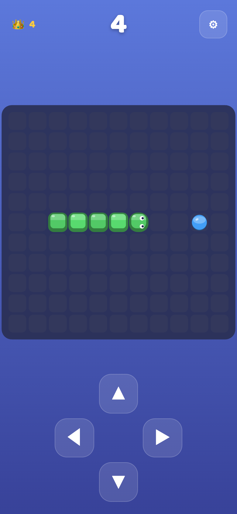
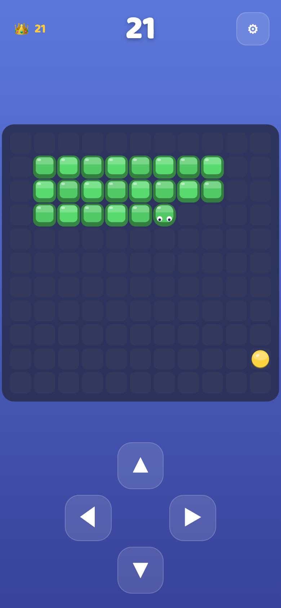
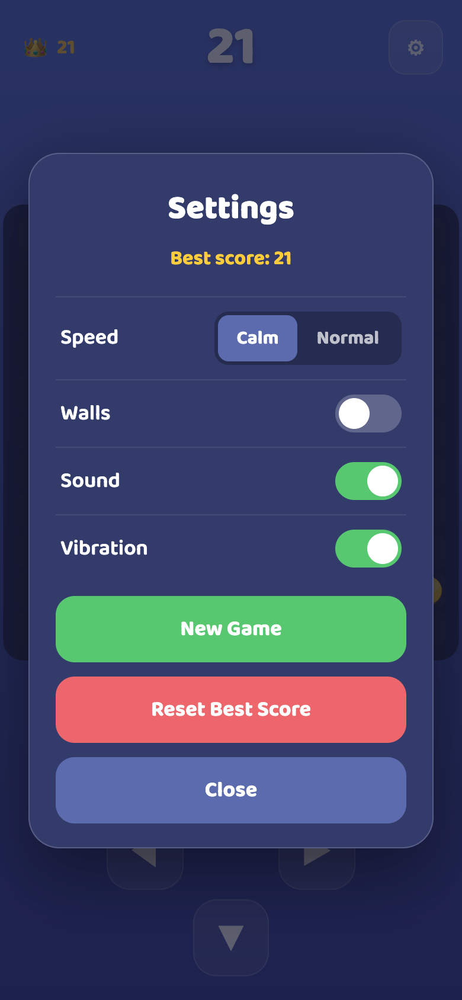

# 🐍 Snake

A calm, cuddly **Snake** for the [Playground](https://mpmisha.github.io/playground/)
hub — tuned for **smaller kids**. A friendly snake made of glossy candy blocks
munches treats and grows. No timers, no scary game-over: the only way a round
ends is bumping into yourself, and even that is handled softly ("Oops! 🐍 — Play
Again"). By default the edges **wrap around**, so the youngest players basically
can't lose except by running into their own tail.

Part of the shared Playground design system: **Baloo 2**, the `#20264f` twilight
palette, and the beveled-candy block look.

## Screenshots

<p align="center">
  
  
  
</p>

## How to play
- **Swipe** up / down / left / right to steer — or tap the big **on-screen D-pad
  arrows**. Turns are buffered so a slightly-early swipe still counts.
- Eat the glossy candy **treat** → grow +1 and score +1.
- Running into yourself ends the round gently. Tap **Play Again**.

## Settings (⚙︎)
- **Speed:** *Calm* (default, slow & forgiving) or *Normal*.
- **Walls:** off (default) = edges wrap around; on = solid walls end the round.
- **Sound** / **Vibration** toggles.
- **New Game**, **Reset Best Score**.
- **← Back to Games** appears only when launched from the hub.

Best score is kept on the device (👑 badge, top-left) via `localStorage`.

## Install (Add to Home Screen)
Open the live site on a phone, then use the browser's **Share → Add to Home
Screen**. It installs as a standalone, portrait, offline-capable PWA.

## Run locally
```bash
python3 -m http.server 8000
# then open http://localhost:8000/
```

## Regenerate the icon
```bash
python3 tools/generate_icon.py   # needs Pillow
```

## Tech
Plain HTML/CSS/JS, no build step, no server. Cache-first service worker
(`snake-v1`) precaches the whole shell for offline play. Relative paths only so
it works under the `/snake/` GitHub Pages subpath.

*Calm rules: no ads, no accounts, no tracking, no timers, no purchases.*
